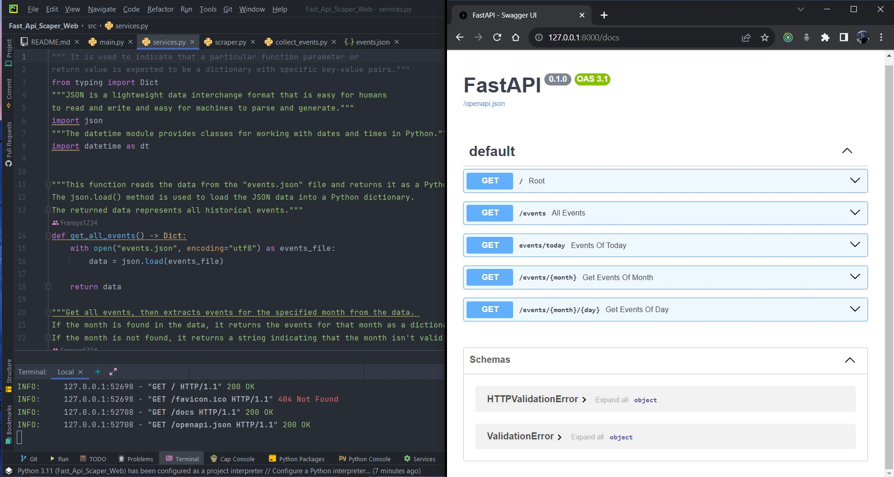
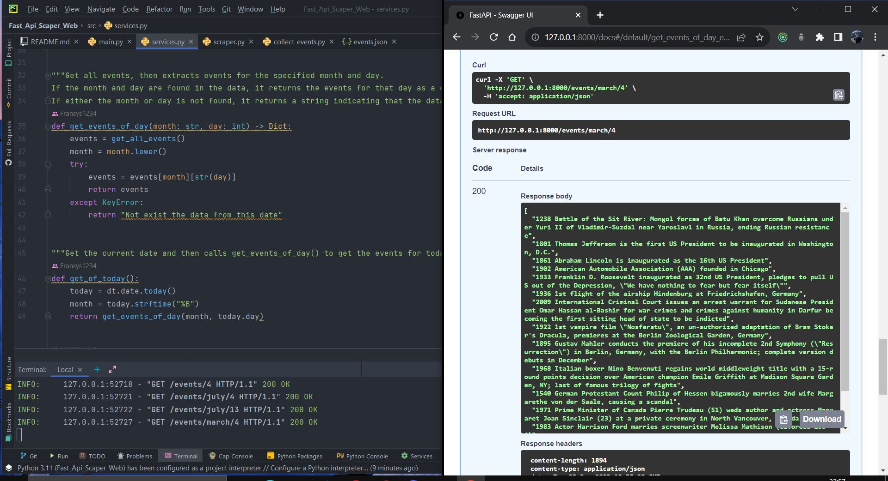
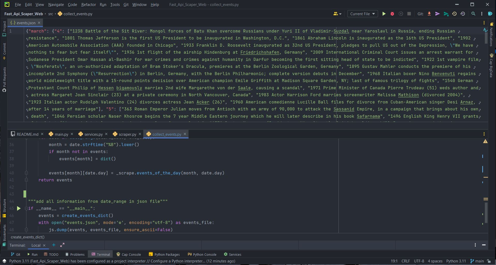

## Fast API Web Scraper
- In this project I coded a web scraper to extract data from the site https://www.onthisday.com with the help of beutiful soup (bs4) and fast api. 
- The given program collects the data on it corresponding to the events that will be found. With the help of the functions, we collected the events that happened in the past according to certain search criteria (events for today, events of the month, events of the day and of the month).
- FastAPI provides a simple and efficient way to create APIs, while BeautifulSoup can be used to parse HTML content and extract the desired data from web pages. In the end, I used unittest and pytest for testing when calling functions, get request and checking status_code when executing the code from the rest api docs interface.
- This data collected by this app i convert in json file and saved in project directory
## Start Project
### Installation packages
- First of all, we have to create a virtual environment and then install it with the command pip install -> bs4, fast api and for testing pytest.

### Steps project
- Create scraper.py, in this file i performs web scraping to extract historical events from the website "onthisday.com." The script uses the requests library to make HTTP requests and the BeautifulSoup library to parse the HTML content of the web pages and extract the desired data.

- Importing Required Libraries i imported the necessary libraries at the beginning of the script. Use the typing module to define type hints like List for function return values. Also imported the requests library for making HTTP requests and the BeautifulSoup library to parse HTML content.

- Defining Helper Functions -> The script defines three functions:
=> generate_url(month: str, day: int) -> str: This function takes the month and day as arguments and returns the URL for the specified date on "onthisday.com."

=> get_page(url: str) -> _bs4: This function takes a URL as an argument and returns the BeautifulSoup object (parsed HTML content) of the web page.

=> events_of_the_day(month: str, day: int) -> List[str]: This function takes month and day as arguments, fetches the events of the specified date from "onthisday.com," and returns them as a list of strings.

- Execution this code i've called the events_of_the_day function with the parameters "february" and 24. This executes the web scraping process for the events that occurred on February 24th and prints the extracted events to the terminal.
## Next step of the project
- For collected all data from scapper file i create cillect_event.py file.
The code is generating a JSON file with historical events data for the specified date range. The data is organized by month, with each day of the month having a list of events associated with it.
- Importing Required Libraries: The code imports necessary libraries such as datetime with an alias dt, Iterator, and Dict from typing. It also imports scraper module (presumably containing web scraping functions) as _scrape, and the json module with an alias js.

 - Defining date_range() Function: This function generates an iterator of dates within a specified date range. It takes two arguments, start_date and end_date, both of type datetime.date, and uses the datetime.timedelta to generate dates between the two given dates.

- Defining create_events_dict() Function: This function creates a dictionary of historical events for a range of dates. It initializes an empty dictionary events and then iterates through each date in the date range (March 4, 2023, to May 15, 2023). It converts each date to its corresponding month name in lowercase, and if the month is not present in the events dictionary, it creates an entry for it. The function then calls _scrape.events_of_the_day() (presumably a web scraping function) to get the events for that specific date (month and day) and populates the nested dictionary events with the events for each day in the respective month.

- Executing and Writing Data to JSON: The script executes the create_events_dict() function and stores the resulting events dictionary into a JSON file named "events.json." It opens the file in write mode (mode='w') and writes the dictionary as JSON data using json.dump() with ensure_ascii=False to preserve non-ASCII characters.
## Final step of the project
### Create Fast api
- In main.py I created a FastAPI application with various API endpoints to serve historical events data using functions from the services module. Let's go through the code and understand each part:

- Importing Libraries: You've imported FastAPI from the fastapi module to create the web application. You also have an import statement for the services module (commented out as import serv), which presumably contains the functions to fetch historical events data.

 - Creating a FastAPI Application: You've initialized a FastAPI application instance with app = FastAPI().

 - Defining API Endpoints: You've defined several API endpoints using the @app.get() decorator. Each endpoint corresponds to a specific URL path, and when a request is made to that path, the associated function is executed.
- For run server of Fast Api just type => uvicorn main:app --reload and after type "docs" after localhost in url and you will see evrey get request of this program with FastAPI. 
## Tests
- I've written unit tests for the FastAPI application using the unittest module. The tests are designed to ensure that the endpoints in the FastAPI app behave as expected. For unittest_main.py i create next functions:

- Importing Libraries: You've imported the necessary modules to perform unit testing. The unittest module is used to create and run test cases, and the TestClient class from fastapi.testclient is used to make HTTP requests to the FastAPI application for testing.

- Test Cases: I've defined a test case class named TestApp, which subclasses unittest.TestCase. This class contains several test methods, each corresponding to a specific endpoint in the FastAPI app.

- setUp Method: The setUp method is a special method in unittest that runs before each test case. It sets up the TestClient instance, which will be used to make HTTP requests to the FastAPI app during testing.

- Test Methods: Each test method performs a specific test on an endpoint. For example:

- test_root: This method tests the root endpoint ("/") of the FastAPI app. It sends a GET request to the root URL and checks whether the response status code is 200 (indicating success) and whether the JSON response matches the expected message.

- test_all_events, test_events_of_today, test_get_events_of_month, test_get_events_of_day: These methods perform similar tests for the respective endpoints ("/events", "/events/today", "/events/april", and "/events/april/1").

- Executing the Tests: The if __name__ == "__main__": block ensures that the unit tests are executed only when the script is run directly (not when imported as a module). When you run the script directly, the unittest.main() function is called, which runs all the test cases defined in the TestApp class.
- To execute this test i run next command in the terminal =>  python -m unittest tests/unittes_main.py in src directory.

#### Fig.1 FastAPI docs

#### Fig.2 Get all events

#### Fig.3 Export to json format
